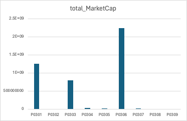

# Data Set Details

In this assignment, I searched for the Chinese stock trading series data from 1/1/2008 to 12/31/2023 on [CSMAR](https://global-csmar-com.proxy.library.nyu.edu/). 

The original data file is in `.txt` format.

In the original data file, some of the raw data looking like this:

|Stkcd|	Stknme_en|	Listdt|	Conme_en|	OWNERSHIPTYPE_EN|	OWNERSHIPTYPECODE|	Ipoprc|	Nshripo	Parval|	Markettype|
|--|--|--|--|--|--|--|--|--|
|000166	|SWHY	|2015-01-26	|Shenwan Hongyuan Group Co., Ltd.	|State-run or State-owned Holding	|P0301	|4.8600	|8140985	|1.0000000000	|4|
|000333	|MDJT	|2013-09-18	|Midea Group Co., Ltd.	|Private Enterprises	|P0306	|44.5600	|686323	|1.0000000000	|4|
|001201	|DRGF	|2021-04-28	|Dongrui Food Group Co., Ltd.	|Private Enterprises	|P0306	|63.3800	|31670	|1.0000000000|	4|
|001202	|JSGF	|2021-04-29	|Guangdong Jushen Logistics Co., Ltd.	|Private Enterprises	|P0306	|15.0900	|32242	|1.0000000000	|4|
|001203	|DZKY	|2021-05-10	|Inner Mongolia Dazhong Mining Co., Ltd.	|Private Enterprises	|P0306	|8.9800	|218940	|1.0000000000	|4|
|001205	|SHGF	|2021-05-13	|Nanjing Shenghang Shipping Co., Ltd.	|Private Enterprises	|P0306	|16.5200	|30067	|1.0000000000	|4|
|001206	|YYGF	|2021-05-18	|Tianjin Yiyi Hygiene Products Co., Ltd.	|Private Enterprises	|P0306	|44.6000	|23583	|1.0000000000	|4|
|001207	|LKKJ	|2021-06-23	|Shandong Link Science and Technology Co., Ltd.	|Private Enterprises	|P0306	|14.2700	|45500	|1.0000000000	|4|
|001208	|HLXL	|2021-06-24	|Hunan Valin Wire & Cable Co., Ltd.	|Private Enterprises	|P0306	|3.6700	|133606|	1.0000000000	|4|
|001209	|HXGF	|2021-07-23	|Guangdong Hongxing Industrial Co., Ltd.	|Private Enterprises	|P0306	|29.8800	|23487	|1.0000000000	|4|
|001210	|JFNY	|2021-07-29	|Kingfore Energy Group Co., Ltd.	|Private Enterprises	|P0306	|28.0100	|22690	|1.0000000000|	4|
|001211	|SQKJ	|2021-08-05	|Suncha Technology Co., Ltd.	|Private Enterprises	|P0306	|26.4000	|18000	|1.0000000000	|4|
|001212	|ZQXC	|2021-08-23	|Sinostone (Guangdong) Co., Ltd.|	Private Enterprises	|P0306	|31.6700	|22670	|1.0000000000|	4|
|001213	|ZTTH	|2021-09-08	|China Railway Special Cargo Logistics Co., Ltd.	|Private Enterprises	|P0306	|3.9600|	444444	|1.0000000000	|4|
|001215	|QWYC	|2021-09-06	|Zhengzhou Qianwei Yangchu Food Co., Ltd.	|Private Enterprises	|P0306|	15.7100|	21280	|1.0000000000|	4|
|001216	|HCGF	|2021-10-19	|Hunan Hualian China Industry Co., Ltd.	|Sino-foreign Equity Joint Venture	|P0303	|9.3700	|62967	|1.0000000000	|4|
|001217	|HET	|2021-09-29	|Anhui Huaertai Chemical Co., Ltd.	|Private Enterprises	|P0306	|10.4600	|82970	|1.0000000000	|4|
|001218	|LCSY	|2021-10-15	|Hunan Resun Co., Ltd.	|Private Enterprises	|P0306	|45.5100	|22500	|1.0000000000	|4|
|001219	|QDSP	|2021-10-21	|Qingdao Foods Co., Ltd.	|State-run or State-owned Holding	|P0301	|17.2000	|22200|	1.0000000000|	4|
|001222	|YFCW	|2022-08-18	|Wenzhou Yuanfei Pet Toy Products Co., Ltd.	|Private Enterprises	|P0306	|13.7100	|34100	|1.0000000000	|4|

To write the raw data file into a CSV file, the major issue is that most of the company names consist of "Co., Ltd.", which would be read and re-write into two comma separated values. The minor issue is that for the `Ipoprc` and `Nshripo` columns, the original data file displays a value of -9999 in the case of missing data, and I replace it with a `NaN` value for future calculations. 

```
# Process each line. 
for line in f_in:
    line_no_comma = line.replace(',', '')

    # Handle missing data. 
    goodline = line_no_comma.strip().replace('-9999', 'NaN')
    data_pts = goodline.split('\t')
    processed_line = ','.join(data_pts)
    f_out.write(processed_line + '\n')
```

Through the previous codes I have munged the raw data file [`TRD_Co.txt`](https://github.com/dbdesign-students-spring2024/3-spreadsheet-analysis-WillYuweiWu/tree/main/data/TRD_Co.txt) into a clean CSV file [`clean_data.csv`](https://github.com/dbdesign-students-spring2024/3-spreadsheet-analysis-WillYuweiWu/tree/main/data/clean_data.csv), and the resulting spreadsheet file is [`CSMAR.xlsx`](https://github.com/dbdesign-students-spring2024/3-spreadsheet-analysis-WillYuweiWu/tree/main/data/CSMAR.xlsx). 

# Data Analysis

## Aggregate Statistics

|Variable Name|Meaning|Value|
|--|--|--|
|mean_Ipoprc|Average IPO Price|23.7500476|
|max_Ipoprc|Maximum IPO Price|557.8|
|min_Ipoprc|Minimum IPO Price|1.22|
|mean_Nshripo|Average Number of Shares Issued|93476.50113|
|max_Nshripo|Maximum Number of Shares Issued|25570588|
|min_Nshripo|Minimum Number of Shares Issued|1200|

In terms of the distributions of IPO Prices and Number of Shares Issued, none of the two is approximately normally distributed. Note that for both the IPO Prices and Number of Shares Issued, there exist extremely high values that could indicate extremely high market popularity or evaluations. 

## Aggregate Statistics with Conditions

|Variable Name|Meaning|Value|
|--|--|--|
|mean_Ipoprc_P0301|Average IPO Price for State-owned or State-Holding Enterprise|15.18258741|
|mean_Ipoprc_P0302|Average IPO Price for Sino-foreign Cooperative Joint Venture|NaN|
|mean_Ipoprc_P0303|Average IPO Price for Sino-foreign Equity Joint Venture|23.9682363|
|mean_Ipoprc_P0304|Average IPO Price for Wholly Foreign-owned Enterprise|62.625|
|mean_Ipoprc_P0305|Average IPO Price for Collectively-owned Enterprise|21.38|
|mean_Ipoprc_P0306|Average IPO Price for Private Enterprise|24.86744092|
|mean_Ipoprc_P0307|Average IPO Price for Public Institution|17.66|
|mean_Ipoprc_P0308|Average IPO Price for Government Agency|NaN|
|mean_Ipoprc_P0309|Average IPO Price for Others|NaN|

Note that wholly foreig-owned enterprises have the highest IPO Prices on average, which implies that the Chinese economy is most optimistic about foreign investments during its recovery from the great recession. 

## Market Cap Visualization

The market capitalization of a company is the total monetary value of its outstanding shares of stock. In the IPO stage of a company, the market cap is given by the total number of shares issued times the IPO price of a share. The following two charts visualize the total market cap for different company natures in the given period. 




From the two graphs, note that since the great recession, private enterprises really took over the market and is the type of company with the highest proportion of market cap: about twice the volume of state-owned or state-holding enterprises and three times the volumn of sino-foreign equity joint venture. Also note that in terms of market cap, wholly foreign-owned enterprise is not a big player in the game, despite its highest average IPO price. 

## Extra Credit

I think this assignment deserve extra credit because of it large size. The clean data set consists of nearly 4000 rows with various sub-catagories. 